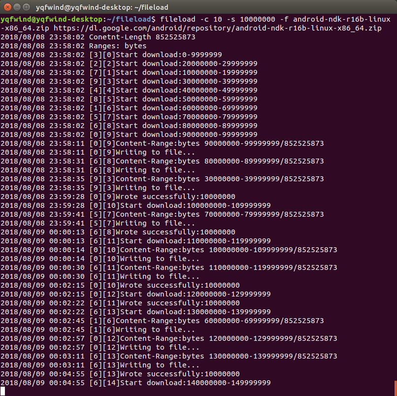

# fileload
fileload 是一个使用golang写的分块下载程序，利用golang的多线程优势，并发分块下载一个文件，并最后组装在一起。

fileload is a golang app for downloading file with chunks, used coroutines,  piecing chunks together finally.


#### Install

```
go get -u github.com/WindGreen/fileload
```


#### Run

下载

```bash
fileload [-c n] [-s size] [- f filename] url
```

示例

```bash
# version
fileload -version
# download with one coroutine
fileload -f xx.zip http://xxx.com/xx.zip
# download with 10 coroutines
fileload -c 10 -f xx.zip http://xxx.com/xx.zip
# download with coroutines and specify the size of chunk to 1M
fileload -c 10 xx.zip -s 1000000 -f xx.zip http://xxx.com/xx.zip
# only sum the hash
fileload -v xx.zip
```





